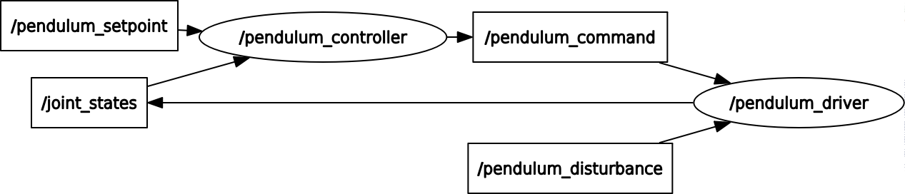

# Inverted pendulum demo

[](https://gitlab.com/LanderU/pendulum/commits/master)
[](https://gitlab.com/LanderU/pendulum/commits/master)


### Project description

The aim of this project is show the real-time capabilities using the ROS2 framework. This project is based on the [previous](https://index.ros.org/doc/ros2/Tutorials/Real-Time-Programming/) work made by the Open Robotics. The project uses these packages as a base.



#### Install instructions

In order to get the project ready, first you need to install [ROS2](https://index.ros.org/doc/ros2/Installation/Dashing/) and [rosdep](http://wiki.ros.org/rosdep).


```bash
source /opt/ros/dashing/setup.bash
mkdir -p ~/pendulum_ws/src
cd ~/pendulum_ws/src
git clone https://gitlab.com/LanderU/pendulum/ # Change me with valid github URL @LanderU
cd ~/pendulum_ws
sudo rosdep init
rosdep update
rosdep install --from-paths src --ignore-src --rosdistro dashing -y
colcon build --merge-install # OR colcon build --symlink-install
```

#### Run instructions

```bash
fill me!
```

#### How to run the demo

Terminal 1:
```bash
ros2 launch pendulum_bringup pendulum_bringup.launch.py
```

Terminal 2. Activate nodes. Put '0' to activate all nodes:
```bash
ros2 run pendulum_manager pendulum_manager
```

Terminal 3. Launch rviz:
```bash
ros2 run rviz2 rviz2 -d `ros2 pkg prefix pendulum_bringup --share`/config/pendulum.rviz
```


ros2 topic pub -1 /pendulum_setpoint pendulum_msgs_v2/msg/PendulumCommand "cart_position: 5.0"

In a new terminal. Move the to x=5:
```bash
ros2 topic pub -1 /pendulum_setpoint pendulum_msgs_v2/msg/PendulumCommand "cart_position: 5.0"
```


Not let's try to push the cart by sending a disturbance force:
```bash
ros2 topic pub -1 /pendulum_disturbance pendulum_msgs_v2/msg/PendulumCommand "cart_force: 100"
```


# Memory analysis

You can use OSRF memory tools to find memory allocations in your application. To enable it
you need to do the following steps, assuming you already did compile performance test before:

1. Enter your work space: `cd pendulum_ws/src`
1. Clone OSRF memory memory tools: `git clone https://github.com/osrf/osrf_testing_tools_cpp.git`
1. Build everything `colcon build --merge-install`
1. You need to preload the memory library to make diagnostics work: `export LD_PRELOAD=$(pwd)/install/lib/libmemory_tools_interpose.so`
1. Run with memory check enabled: `ros2 run pendulum_demo pendulum_demo  --memory-check`

Note that enabling this feature will cause a huge performance impact.

#### How to contribute

Make a fork using github, and make your changes. This project uses the same guidelines as all the officials ROS2 packages, make sure that your code is compliant with cppcheck, uncrustify...
After this, submit a PR and we will review as soon as possible.

#### Issues and feature request

Please, use the templates and make sure that you labeled them properly. Also, consider to open a PR using the template to fix the issue or to implement a feature.
