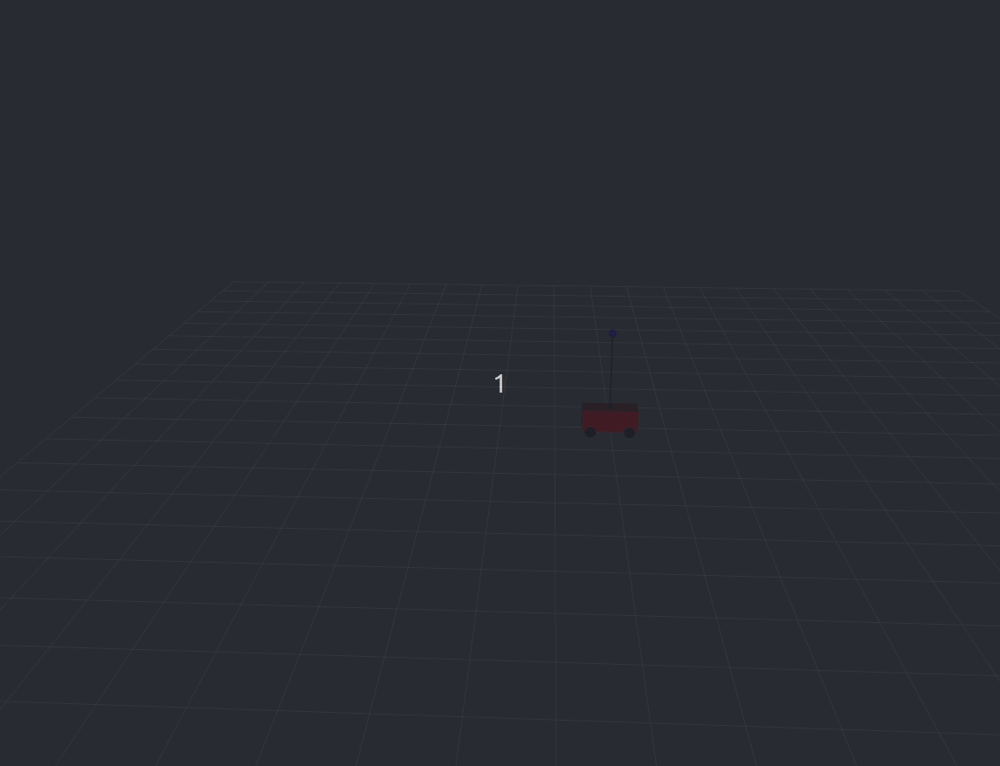
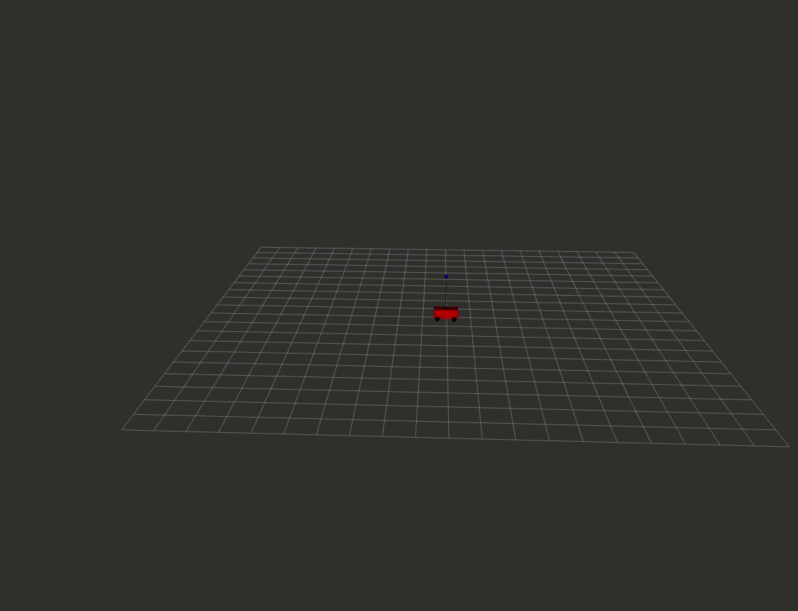

# Inverted pendulum demo

### Build status

| eloquent |  dashing | master |
|--------- | -------- | ------- |
| [](https://travis-ci.com/ros2-realtime-demo/pendulum)  | [](https://travis-ci.com/ros2-realtime-demo/pendulum) | [](https://travis-ci.com/ros2-realtime-demo/pendulum) |

[]() 

# Table of content

* [Inverted pendulum demo](#inverted-pendulum-demo)
    * [Project description](#project-description)
    * [Install instructions](#install-instructions)
    * [How to run the demo](#how-to-run-the-demo)
    * [Managed nodes](#managed-nodes)
    * [Real-time demo](#rtdemo)
    * [How to contribute](#how-to-contribute)
    * [Issues and feature request](#issues-and-feature-request)

### Project description

The aim of this project is to show the real-time capabilities using the ROS2 framework. This project is based on the [previous](https://index.ros.org/doc/ros2/Tutorials/Real-Time-Programming/) work made by the Open Robotics. The project uses these packages as a base.

This is the motivation of using an inverted pendulum for a real-time demo:

>A classic example of a controls problem commonly solved by real-time computing is balancing an inverted pendulum. If the controller blocked for an unexpectedly long amount of time, the pendulum would fall down or go unstable. But if the controller reliably updates at a rate faster than the motor controlling the pendulum can operate, the pendulum will successfully adapt react to sensor data to balance the pendulum.

For a more detailed description of demo the project design be found here: [Design Article](docs/design.md)

#### Install instructions

In order to get the project ready, first you need to install [ROS2](https://index.ros.org/doc/ros2/Installation/Eloquent/) and [rosdep](http://wiki.ros.org/rosdep).


```bash
source /opt/ros/eloquent/setup.bash
mkdir -p ~/pendulum_ws/src
cd ~/pendulum_ws/src
git clone https://github.com/ros2-realtime-demo/pendulum
cd ~/pendulum_ws
sudo rosdep init
rosdep update
rosdep install -q -y --from-paths src --ignore-src --rosdistro eloquent
colcon build --merge-install # OR colcon build --symlink-install
```

#### How to run the demo

Terminal 1:
```bash
ros2 launch pendulum_bringup pendulum_bringup.launch.py
```

Terminal 2. Activate nodes. Put '0' to activate all nodes:
```bash
ros2 run pendulum_manager pendulum_manager
```

Terminal 3. Launch rviz:
```bash
export LC_NUMERIC="en_US.UTF-8" # Make sure that your locales are correctly setup.
ros2 run rviz2 rviz2 -d `ros2 pkg prefix pendulum_bringup --share`/config/pendulum.rviz
```

If everything went well we should see now the inverted pendulum being controlled in rviz:


Now we can try to move the cart by sending a setpoint command.


In a new terminal. Move the cart to x=5:
```bash
ros2 topic pub -1 /pendulum_setpoint pendulum_msgs_v2/msg/PendulumCommand "cart_position: 5.0"
```



Now let's try to push the cart by sending a disturbance force:

```bash
ros2 topic pub -1 /pendulum_disturbance pendulum_msgs_v2/msg/PendulumCommand "cart_force: 100"
```


Note the force is applied continuously until a different disturbance force is sent again. We may change this in the future.

#### Managed nodes

The main nodes used in the demo `/pendulum_controller` and `/pendulum_driver` are [managed nodes](https://design.ros2.org/articles/node_lifecycle.html). That is, they inherit from a Lifecycle node and it is posible to control the node state.


The image above was taken from [Jackie Kay's Roscon keynote in 2015](https://roscon.ros.org/2015/presentations/RealtimeROS2.pdf).

All the configurations and memory allocation must be done in the `onConfigure` transition. In active state all the computations should be real-time compliant. This may be not completely true for the moment but it's that's the goal.

The package `pendulum_manager` was created in order to control the state of the nodes easier. This package is in a very early stage, the idea is this package to become a rqt plugin with a control panel.

Just for fun you can try to deactivate the controller node while the simulation is active to see the pendulum falling down.

#### Realtime demo <a name="rtdemo"></a>

A detailed tutorial for real-time testing can be found [here](docs/real_time_tutorial.md).

#### How to contribute

Make a fork using github, and make your changes. This project uses the same guidelines as all the officials ROS2 packages, make sure that your code is compliant with cppcheck, uncrustify...
After this, submit a PR and we will review as soon as possible.

#### Issues and feature request

Please, use the [templates](https://github.com/ros2-realtime-demo/pendulum/issues/new/choose) and make sure that you labeled them properly. Also, consider to open a PR to fix the issue or to implement a feature.
