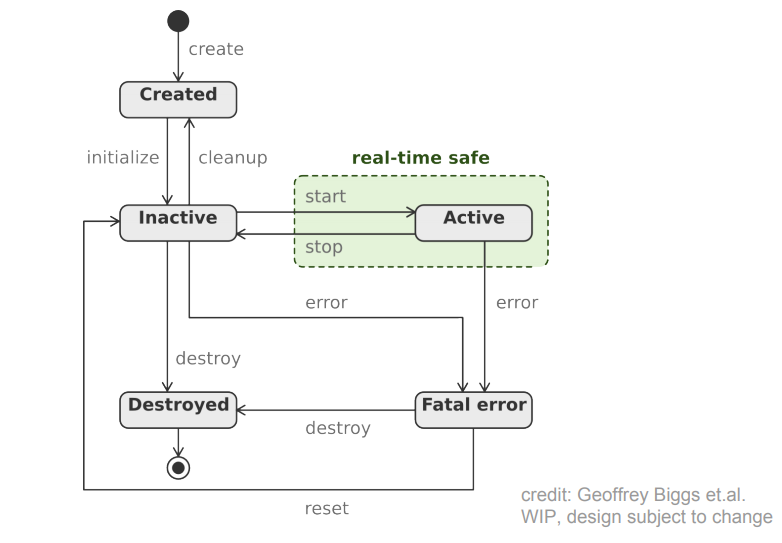

## Pendulum demo design

### Purpose

This is a rework of the existing pendulum demo in [ros2/demos](https://github.com/ros2/demos). The aim of this project is to
 create a complete use case to show ROS 2 real-time capabilities. The goal is not measure ROS 2
  real-time performance but to show how ROS 2 could be used for a real-time application. Ideally
   this project could help ROS developers to understand how to program a ROS 2 application in C
   ++, which ROS 2 features could be used, how to configure the process and how to instrument
    the application to verify the real-time capabilities.    
    
### Managed nodes

The main nodes used in the demo `/pendulum_controller` and `/pendulum_driver` are 
[managed nodes](https://design.ros2.org/articles/node_lifecycle.html). They inherit from a 
Lifecycle node and it is possible to control the node state. All the configurations and dynamic 
memory allocation must be done before entering to the Active tate, for example in the
 `onConfigure` transition.

The image above was taken from [Jackie Kay's Roscon keynote in 2015](https://roscon.ros.org/2015/presentations/RealtimeROS2.pdf).

### Component overview

* `PendulumControllerNode`: Class derived from `LifecycleNode` that implements the ROS 2 interface 
for the pendulum controller.
* `PendulumController`: A controller implementation based on a
 [full state feedback controller](https://en.wikipedia.org/wiki/Full_state_feedback).
* `PendulumDriverNode`: Class derived from `LifecycleNode` that implements the ROS 2 interface for
 a simulated pendulum.
* `PendulumDriver`: A class which implements a simulation of a cart-pole based pendulum.
* `pendulum_demo`: The main program which configures the process settings, creates and executor
, adds a `PendulumControllerNode` and a `PendulumDriverNode`  using manual composition and spins
 all the nodes.
